# 🤖 Automated Fortnightly Data Update Setup

This guide will help you set up automatic fortnightly data updates for your FPI dashboard.

## 📋 Prerequisites

- GitHub account with your repository
- Render account with deployed app
- Basic understanding of Git

## 🚀 Setup Steps

### 1️⃣ Create GitHub Actions Workflow

1. In your repository, create this folder structure:
   ```
   .github/
   └── workflows/
       └── update_data.yml
   ```

2. Copy the `update_data.yml` content into this file

3. Commit and push to GitHub

### 2️⃣ Get Render Deploy Hook

1. Go to your Render dashboard: https://dashboard.render.com
2. Select your deployed app
3. Click on **Settings** (left sidebar)
4. Scroll down to **Deploy Hook**
5. Click **Create Deploy Hook**
6. Copy the webhook URL (looks like: `https://api.render.com/deploy/srv-xxxxx?key=xxxxx`)

### 3️⃣ Add Deploy Hook to GitHub Secrets

1. Go to your GitHub repository
2. Click **Settings** → **Secrets and variables** → **Actions**
3. Click **New repository secret**
4. Name: `RENDER_DEPLOY_HOOK`
5. Value: Paste the Render deploy hook URL
6. Click **Add secret**

### 4️⃣ Add Scraper Script

1. Place `scraper.py` in your repository root
2. Commit and push:
   ```bash
   git add scraper.py
   git commit -m "Add automated scraper"
   git push
   ```

### 5️⃣ Update requirements.txt

Add these dependencies:
```txt
beautifulsoup4>=4.12.0
openpyxl>=3.1.0
xlrd>=2.0.1
```

### 6️⃣ Test the Automation

#### Manual Test:
1. Go to **Actions** tab in your GitHub repo
2. Select **Auto-Update FPI Data** workflow
3. Click **Run workflow** → **Run workflow**
4. Wait for completion (usually 2-5 minutes)
5. Check if CSV files were updated

#### Check Logs:
- Click on the workflow run
- Expand each step to see detailed logs
- Look for ✅ success messages or ❌ errors

## 📅 Schedule Details

The automation runs:
- **15th of every month** at 6:30 AM IST (1:00 AM UTC)
- **Last day of every month** at 6:30 AM IST (1:00 AM UTC)

### Modify Schedule (Optional)

Edit `.github/workflows/update_data.yml`:

```yaml
schedule:
  - cron: '0 1 15 * *'    # 15th day
  - cron: '0 1 L * *'     # Last day
```

**Cron format:** `minute hour day month day-of-week`
- Use https://crontab.guru/ to create custom schedules

## 🔍 How It Works

```mermaid
graph LR
    A[GitHub Actions Trigger] --> B[Run scraper.py]
    B --> C[Scrape NSDL Website]
    C --> D[Download New Reports]
    D --> E[Update CSV Files]
    E --> F[Commit Changes]
    F --> G[Push to GitHub]
    G --> H[Trigger Render Deploy]
    H --> I[Render Pulls Latest Code]
    I --> J[Dashboard Updated! ✅]
```



## 🛠️ Troubleshooting

### Issue: Scraper not finding reports

**Solution:** 
- Check NSDL website structure hasn't changed
- Update scraper selectors if needed
- Check logs in GitHub Actions

### Issue: Render not updating

**Solution:**
- Verify `RENDER_DEPLOY_HOOK` is set correctly
- Check Render deployment logs
- Ensure auto-deploy is enabled on Render

### Issue: GitHub Actions failing

**Solution:**
```bash
# Test scraper locally first
python scraper.py

# Check for errors
# Fix any issues in scraper.py
```

### Issue: CSV files not updating

**Solution:**
- Check if new data exists on NSDL
- Verify date comparison logic in scraper
- Run manual workflow to test

## 📊 Monitoring

### View Automation Status:
1. **GitHub:** Check Actions tab for workflow runs
2. **Email:** GitHub sends notifications on failures
3. **Render:** Check deployment logs

### Enable Notifications:
1. Go to GitHub repo → **Settings** → **Notifications**
2. Enable **Actions** notifications
3. Choose email/Slack/Discord

## 🔐 Security Best Practices

✅ **DO:**
- Use GitHub Secrets for sensitive data
- Keep deploy hooks private
- Regularly update dependencies

❌ **DON'T:**
- Commit API keys or secrets to repo
- Share deploy hook URLs publicly
- Disable authentication

## 📝 Manual Data Update (Backup)

If automation fails, update manually:

```bash
# 1. Run scraper locally
python scraper.py

# 2. Commit changes
git add *.csv
git commit -m "Manual data update"
git push

# 3. Render will auto-deploy (if enabled)
```

## 🎯 Next Steps

- [ ] Set up email notifications for failures
- [ ] Create data validation checks
- [ ] Add data quality monitoring
- [ ] Set up backup data sources
- [ ] Create dashboard health checks

## 💡 Tips

1. **Test First:** Always run manual workflow before relying on schedule
2. **Monitor Regularly:** Check first few automated runs
3. **Backup Data:** Keep local backups of CSV files
4. **Version Control:** Use Git tags for important updates

## 📞 Support

If you encounter issues:
1. Check GitHub Actions logs
2. Review Render deployment logs
3. Verify NSDL website is accessible
4. Test scraper locally

---

**Last Updated:** 2025-01-01  
**Automation Status:** ✅ Active